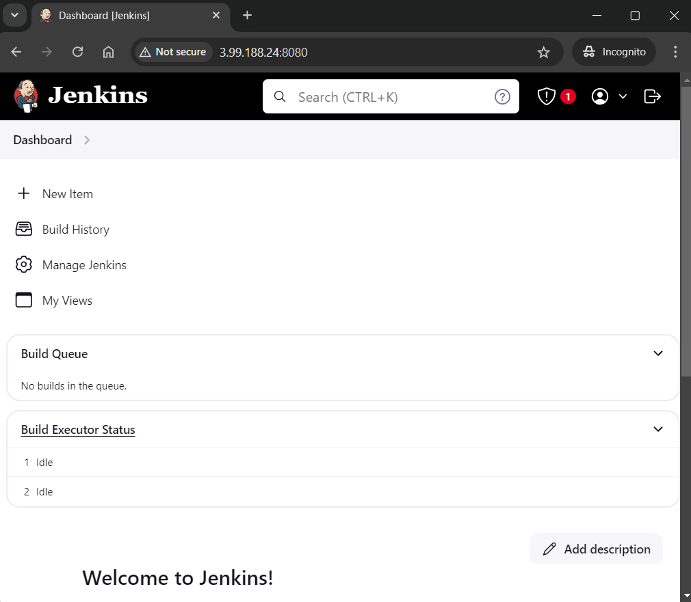

# Jenkins-in-Docker-Container-Script

The objective of this Project is to create a bash script that automatically setup ready to use Jenkins in Docker container From Scratch.
<br>
<br>

## Technology Used for the Project
- Bash

- Docker

- Jenkins
<br>

## Prerequisites
- Debian-based Linux with Internet Connection

	+ For demonstration purpose, <code style="color : purple">**Terraform**</code> has been used to deploy <code style="color : orange">AWS EC2 Instance</code> <u>with Ubuntu Image</u>

```bash
module.vpc1.aws_route_table_association.public[0]: Creating...
aws_instance.test_vm: Creating...
module.vpc1.aws_default_network_acl.this[0]: Creation complete after 1s [id=acl-00ccc97667db8fa5d]
module.vpc1.aws_route_table_association.public[0]: Creation complete after 1s [id=rtbassoc-037f95584a2f52b7b]
module.vpc1.aws_default_security_group.this[0]: Creation complete after 2s [id=sg-0a2fabd94d7d8c9f0]
module.vpc1.aws_route.public_internet_gateway[0]: Creation complete after 1s [id=r-rtb-0a9391fb2931eb9b91080289494]
aws_instance.test_vm: Still creating... [10s elapsed]
aws_instance.test_vm: Creation complete after 14s [id=i-0c31af8fcf751e139]

Apply complete! Resources: 11 added, 0 changed, 0 destroyed.

Outputs:

EC2_Public_IP = "3.99.188.24"
```

```bash
$ cat /etc/lsb-release
DISTRIB_ID=Ubuntu
DISTRIB_RELEASE=24.04
DISTRIB_CODENAME=noble
DISTRIB_DESCRIPTION="Ubuntu 24.04 LTS"
```


### Make Script Executable & Run it
```bash
cd Jenkins-in-Docker-Container-Script 


sudo chmod +x Prepare_Jenkins_in_Docker.sh


./Prepare_Jenkins_in_Docker.sh
```
<br>

---

### Demo
``` bash

🌐 Checking Internet Connection . . .


Internet is Working Fine 👍


➕ Trying to Install Docker & Other Required Packages . . .

The following NEW packages will be installed:
  containerd.io docker-buildx-plugin docker-ce docker-ce-cli docker-ce-rootless-extras docker-compose-plugin
  libltdl7 libslirp0 pigz slirp4netns
0 upgraded, 10 newly installed, 0 to remove and 140 not upgraded.
Need to get 123 MB of archives.
After this operation, 442 MB of additional disk space will be used.
Preparing to unpack .../0-pigz_2.8-1_amd64.deb ...
Unpacking pigz (2.8-1) ...
Selecting previously unselected package containerd.io.
Preparing to unpack .../1-containerd.io_1.7.22-1_amd64.deb ...
Unpacking containerd.io (1.7.22-1) ...
.
.
.
Docker Installed Successfully 👍


➕ Creating Jenkins Container . . .

Unable to find image 'jenkins/jenkins:lts' locally
lts: Pulling from jenkins/jenkins
cdd62bf39133: Pull complete
21f106ffc421: Pull complete
39df2c5808cf: Pull complete
d9d5ad5daae2: Pull complete
21d9152ebad0: Pull complete
ddc06df74615: Pull complete
bf388b3d4868: Pull complete
1f6fc1ff002b: Pull complete
276b7c1ccf38: Pull complete
d9ab3d4a2c85: Pull complete
ac000fcb71de: Pull complete
79eacf1576c1: Pull complete
Digest: sha256:429647d4688daa3ca2520fb771a391bae8efa1e4def824b32345f13dde223227
Status: Downloaded newer image for jenkins/jenkins:lts
1a9c4436d87fa44195914f205b9ef7b2be7015b167c039c1e43db5edb2397262

Jenkins Container Created 👍

Jenkins Container is Running 👍
```

```bash

🔍 Getting Jenkins Container Details . . .


🔗 Jenkins url : http://localhost:8080/

👤 Jenkins Username : admin

🔑 Jenkins Password : a312aebc957e48dc9bf7858ae8408c35

💾 Jenkins Persistent Volume Storage Path on Host : /var/lib/docker/volumes/jenkins_volume/

💽 Jenkins Volume Mount Path on Container : /var/jenkins_home/
```


### Verify Jenkins Container
```bash
$ sudo docker ps
CONTAINER ID   IMAGE                 COMMAND                  CREATED         STATUS         PORTS                                                                                      NAMES
1a9c4436d87f   jenkins/jenkins:lts   "/usr/bin/tini -- /u…"   7 minutes ago   Up 7 minutes   0.0.0.0:8080->8080/tcp, :::8080->8080/tcp, 0.0.0.0:50000->50000/tcp, :::50000->50000/tcp   jenkins
```


### Verification of Jenkins Access


